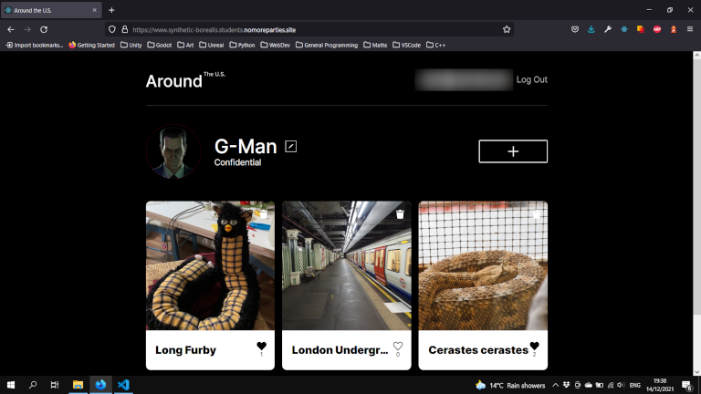
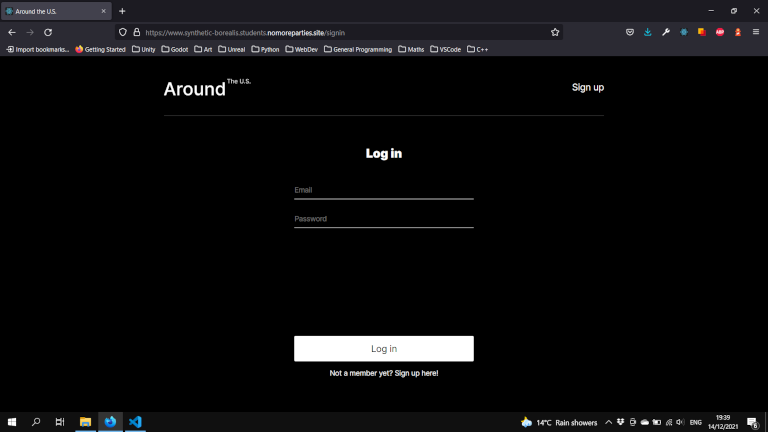
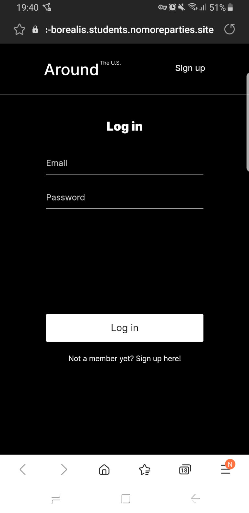
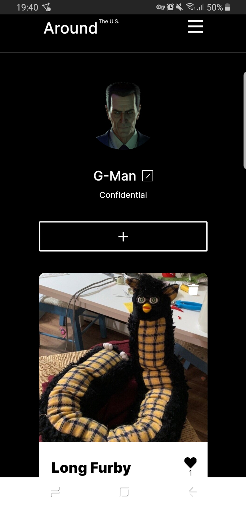
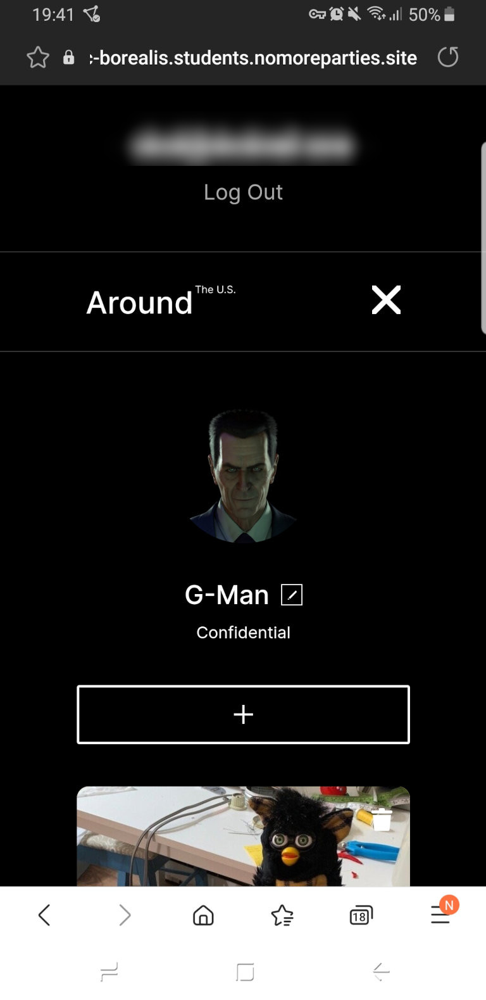

# Around the U.S.

## Table of Contents
* [Overview](#overview)
* [Built With](#built-with)
    * [Frontend](#frontend)
    * [Backend](#backend)
* [Screenshots](#screenshots)
* [Links](#links)

## Overview
Around the U.S. is an image sharing site for travellers, complete with a backend server & user authetication. It is responsive and should display well on different devices and resolutions (including desktop computers, tablets & mobile phones).

## Built With
### Frontend
* HTML5
* CSS
* JavaScript
* React.js

### Backend
* Node.js
* MongoDB
* Mongoose & other libraries (see backend/package.json for a more detailed list).

## Screenshots
<figure>
  
  <figcaption>Fig. 1: Main screen (Firefox, P.C.).</figcaption>
</figure>
<figure>
  
  <figcaption>Fig. 2: Login screen (Firefox, P.C.).</figcaption>
</figure>
 
<figure>
   

      
      
      
   

   <figcaption>Fig. 3: Mobile view (Samsung Internet).</figcaption>
</figure>

## Links
### Project Related
* [Backend Code](https://github.com/synthetic-borealis/react-around-api-full/tree/main/backend)
* [Frontend Code](https://github.com/synthetic-borealis/react-around-api-full/tree/main/frontend)
* [Live Site](https://synthetic-borealis.github.io/react-around-api-full/)
