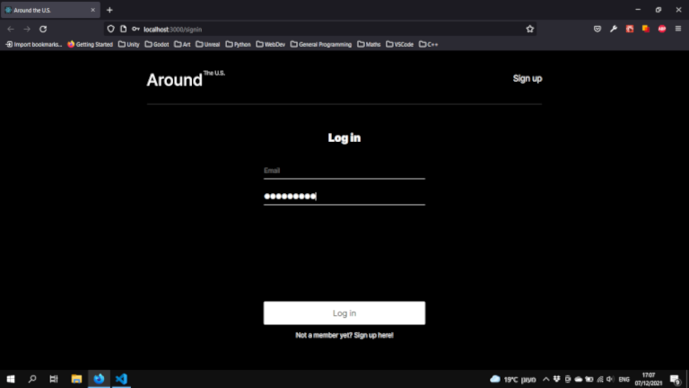
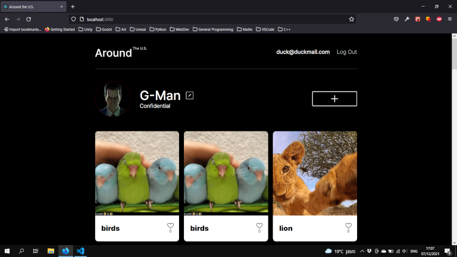

# Around The U.S.

## Table of Contents
- [Overview](#overview)
- [Built With](#built-with)
- [Screenshots](#screenshots)
- [Links](#links)

## Overview
Around The U.S. is a one page website for travellers. It is responsive and should display well on different devices and resolutions (including PCs, tablets & mobile phones).

## Built With
### Frontend
- HTML5
- CSS
- [React](https://reactjs.org/)

### Backend
- Node.js
- Express.js
- MongoDB

## Screenshots
<figure>
  
  <figcaption>Fig. 1: The website's login screen displayed in Firefox.</figcaption>
</figure>

<figure>
  
  <figcaption>Fig. 2: The website's main view.</figcaption>
</figure>

## Possible Improvements
### Refactoring
- More string values could potentially be moved to the constants file.

### Security
- ```handleLogout()``` should inform the server that the previously used token should be discarded.
